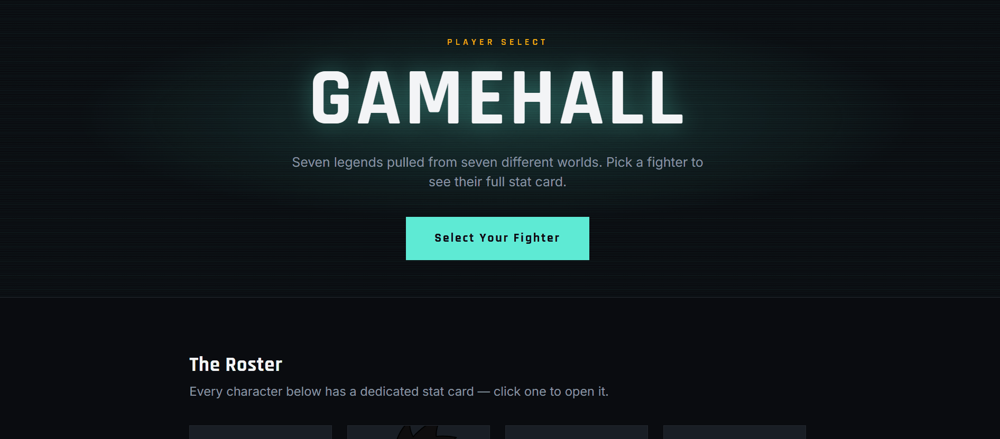

# WEB103 Project 1 - *GameHall*

Submitted by: **Anurag Bheemappa Gnanamurthy**

About this web app: **GameHall is a listicle web app showcasing iconic video game characters. Each character has a name, game, role, power rating, description, and avatar. Users can browse the full roster on the homepage and click into a dedicated detail page for each character.**

Time spent: **2** hours

## Required Features

The following **required** functionality is completed:

<!-- Make sure to check off completed functionality below -->
- [x] **The web app uses only HTML, CSS, and JavaScript without a frontend framework**
- [x] **The web app displays a title**
- [x] **The web app displays at least five unique list items, each with at least three displayed attributes (such as title, text, and image)**
- [x] **The user can click on each item in the list to see a detailed view of it, including all database fields**
  - [x] **Each detail view should be a unique endpoint, such as as `localhost:3000/bosses/crystalguardian` and `localhost:3000/mantislords`**
  - [x] *Note: When showing this feature in the video walkthrough, please show the unique URL for each detailed view. We will not be able to give points if we cannot see the implementation* 
- [x] **The web app serves an appropriate 404 page when no matching route is defined**
- [x] **The web app is styled using Picocss**

The following **optional** features are implemented:

- [x] The web app displays items in a unique format, such as cards rather than lists or animated list items

The following **additional** features are implemented:

- [x] Character avatars are generated dynamically per character using the DiceBear avatar API
- [x] Responsive card grid layout that adapts to mobile screen sizes

## Video Walkthrough

Here's a walkthrough of implemented required features:

<!-- Replace this with whatever GIF tool you used! -->
GIF created with ScreenToGif
<!-- Recommended tools:
[Kap](https://getkap.co/) for macOS
[ScreenToGif](https://www.screentogif.com/) for Windows
[peek](https://github.com/phw/peek) for Linux. -->

## Notes

Built with Express and EJS templates to serve server-rendered HTML without a frontend framework. Character data lives in `data/characters.js`, and routes are defined in `server.js` — a catch-all route renders a styled 404 page for any unmatched path. Picocss (via CDN) provides the base styling, with a small custom stylesheet (`public/style.css`) for the card grid and detail layout.

## License

Copyright 2026 Anurag Bheemappa Gnanamurthy

Licensed under the Apache License, Version 2.0 (the "License"); you may not use this file except in compliance with the License. You may obtain a copy of the License at

> http://www.apache.org/licenses/LICENSE-2.0

Unless required by applicable law or agreed to in writing, software distributed under the License is distributed on an "AS IS" BASIS, WITHOUT WARRANTIES OR CONDITIONS OF ANY KIND, either express or implied. See the License for the specific language governing permissions and limitations under the License. 
